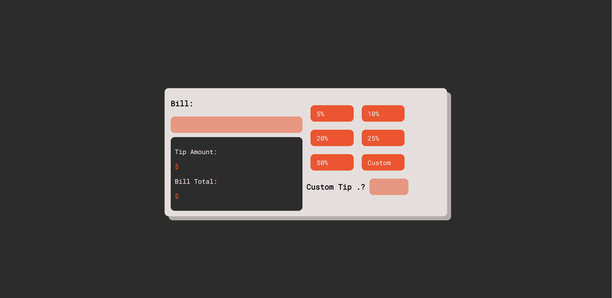

# Tip Calculator

This project was an exercise in using react refrences and state. Use this site to calculate predetermined tax percentages or your own custom amount!

## Check out the project

[Deployment](https://johnathanmann.github.io/tip-calculator/)  
[Repository](https://github.com/johnathanmann/tip-calculator)